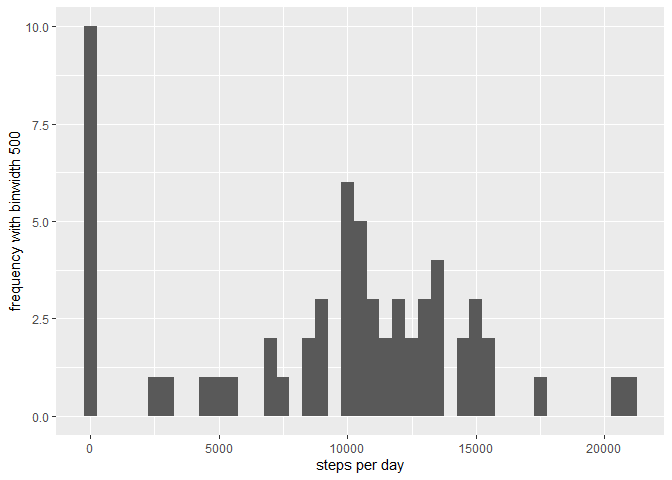
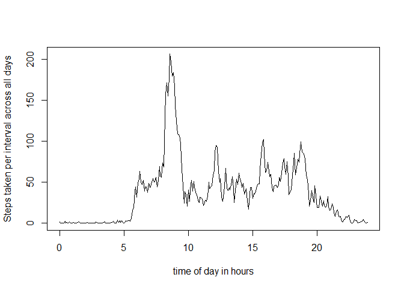
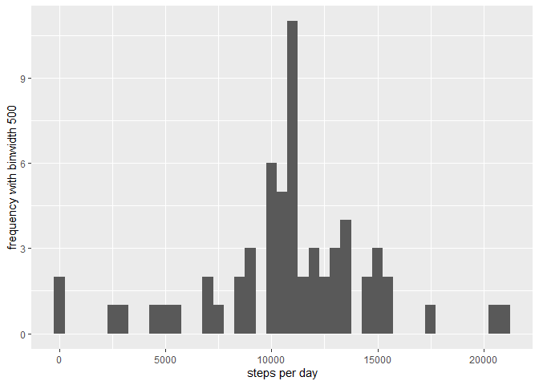
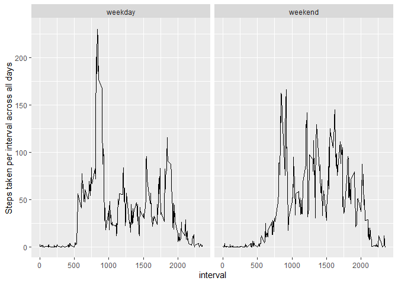

## Loading and preprocessing the data
Loading and preprocessing the data  
Show any code that is needed to  

Load the data (i.e. \color{red}{\verb|read.csv()|}read.csv())  
Process/transform the data (if necessary) into a format suitable for your analysis  


load and clean data
- unzip downloaded file  
- open document  

```r
zipF <- paste("./activity.zip")
unzip(zipF)

d <- read.csv("activity.csv")

#transform date columns
library(lubridate)
d$date <- ymd(d$date)
```

================================================================================  
## What is mean total number of steps taken per day?

What is mean total number of steps taken per day?  
For this part of the assignment, you can ignore the missing values in the dataset.  

1. Calculate the total number of steps taken per day  
2. If you do not understand the difference between a histogram and a barplot, research the difference between them. Make a histogram of the total number of steps taken each day  
3. Calculate and report the mean and median of the total number of steps taken per day   


```r
#total number of steps per day
sum <- tapply(d$steps, d$date, sum, na.rm = TRUE)
d1 <- data.frame(step_sum = sum, date = unique(d$date))

#histogram of steps
library(ggplot2)
d1$step_sum <- as.numeric(d1$step_sum)
d1$date <- as.numeric(d1$date)
ggplot(d1, aes(x=step_sum)) + geom_histogram(binwidth = 500) +ylab("frequency with binwidth 500") + xlab("steps per day")
```

<!-- -->

```r
#mean and median of steps per day
step_mean <- round(mean(d1$step_sum), digits = 2)
step_median <- round(median(d1$step_sum), digits = 2)
```
A: The total steps per day are depicted in the histogram. The mean and median of the total number of steps taken per day are 9354.23 and 1.0395\times 10^{4}, respectively.

===============================================================================  
## What is the average daily activity pattern?

What is the average daily activity pattern?  
1. Make a time series plot (i.e. \color{red}{\verb|type = "l"|}type="l") of the 5-minute interval (x-axis) and the average number of steps taken, averaged across all days (y-axis)  
2. Which 5-minute interval, on average across all the days in the dataset, contains the maximum number of steps?  


```r
step_avg_int <- tapply(d$steps, d$interval, mean, na.rm = TRUE)
d2 <- data.frame(steps_per_interval = step_avg_int, intervals = unique(d$interval))

#format intervals to time
d2$intervals_time <- paste(d2$intervals %/% 100, d2$intervals %% 100, sep = ":")
#integer devision and remainder from 5-minute intervals
d2$intervals_time <- hm(d2$intervals_time)
#format to hh:mm:ss format with lubridate package
d2$intervals_time2 <- as.numeric(d2$intervals_time)/3600
#extract hours of day

plot(d2$intervals_time2, d2$steps_per_interval, type = "l", ylab=c("Steps taken per interval across all days"), xlab=c("time of day in hours"))
```

<!-- -->

```r
library(dplyr)
max.steps <- d2 %>% filter(steps_per_interval == max(steps_per_interval, na.rm = TRUE))
answer <- as.character(max.steps$intervals_time)
```

At 8H 35M 0S AM the step count contains the highest number on average across all days.

===============================================================================  
## Imputing missing values

Imputing missing values
Note that there are a number of days/intervals where there are missing values (coded as \color{red}{\verb|NA|}NA). The presence of missing days may introduce bias into some calculations or summaries of the data.  
1. Calculate and report the total number of missing values in the dataset (i.e. the total number of rows with \color{red}{\verb|NA|}NAs)
2. Devise a strategy for filling in all of the missing values in the dataset. The strategy does not need to be sophisticated. For example, you could use the mean/median for that day, or the mean for that 5-minute interval, etc.


```r
# Task 1: count NAs
na.count <- sum(is.na(d$steps))

#Task 2: impute missing values
d3 <- merge(x = d, y = d2, by.x = "interval", by.y = "intervals", all = TRUE)
        #join original data frame with tapply table where means were computed for each individual interval

d3$steps <- as.numeric(d3$steps)
d3$steps_new <- if_else(is.na(d3$steps), d3$steps_per_interval, d3$steps)
        #if "NA" is present insert mean for this interval, if not use the step count
```

The total amount of "NA" values in the data set is 2304. In order to compute missing values, we will utilize the mean of steps in each interval across all days

3. Create a new dataset that is equal to the original dataset but with the missing data filled in.
4. Make a histogram of the total number of steps taken each day and Calculate and report the mean and median total number of steps taken per day. Do these values differ from the estimates from the first part of the assignment? What is the impact of imputing missing data on the estimates of the total daily number of steps?


```r
#Task 3: create new data set with imputed missing values
d4 <- d3 %>% 
        select(interval, steps_new, date)
d4 <- d4[order(d4$date, d4$interval),]

#Task 4
#total number of steps per day
sum4 <- tapply(d4$steps_new, d4$date, sum, na.rm = TRUE)
d4s <- data.frame(step_sum = sum4, date = unique(d4$date))

#histogram of steps
library(ggplot2)
d4s$step_sum <- as.numeric(d4s$step_sum)
d4s$date <- as.numeric(d4s$date)
ggplot(d4s, aes(x=step_sum)) + geom_histogram(binwidth = 500) +ylab("frequency with binwidth 500") + xlab("steps per day")
```

<!-- -->

```r
#mean and median of steps per day
step_mean_new <- round(mean(d4s$step_sum), digits = 2)
step_median_new <- round(median(d4s$step_sum), digits = 2)
```

A: The total steps after imputing missing values per day are depicted in the histogram. The mean and median of the total number of steps taken per day are 1.076619\times 10^{4} and 1.076619\times 10^{4}, repsectively. These values are higher than before imputing the missing values (values before imputing missing values: mean: 9354.23; median: 1.0395\times 10^{4}).

===============================================================================  
## Are there differences in activity patterns between weekdays and weekends?

Are there differences in activity patterns between weekdays and weekends?  
For this part the \color{red}{\verb|weekdays()|}weekdays() function may be of some help here. Use the dataset with the filled-in missing values for this part.

1. Create a new factor variable in the dataset with two levels – “weekday” and “weekend” indicating whether a given date is a weekday or weekend day.  
2. Make a panel plot containing a time series plot (i.e. \color{red}{\verb|type = "l"|}type="l") of the 5-minute interval (x-axis) and the average number of steps taken, averaged across all weekday days or weekend days (y-axis). See the README file in the GitHub repository to see an example of what this plot should look like using simulated data.


```r
#create facotrized varibale for weekday and weekend
d4$weekday <- weekdays(d4$date)
weekdays1 <- c('Montag', 'Dienstag', 'Mittwoch', 'Donnerstag', 'Freitag')
d4$weekday_s <- factor(d4$weekday %in% weekdays1,levels=c(FALSE, TRUE), labels=c('weekend', 'weekday'))

#calculate average steps during interval across weekdays and weekends
library(dplyr)
d4_weekend <- filter(d4, weekday_s == "weekend")
step_avg_int <- tapply(d4_weekend$steps, d4_weekend$interval, mean, na.rm = TRUE)
d4_weekend_mean <- data.frame(steps_per_interval = step_avg_int, intervals = unique(d4_weekend$interval), label = "weekend")

d4_weekday <- filter(d4, weekday_s == "weekday")
step_avg_int <- tapply(d4_weekday$steps, d4_weekday$interval, mean, na.rm = TRUE)
d4_weekday_mean <- data.frame(steps_per_interval = step_avg_int, intervals = unique(d4_weekday$interval), label = "weekday")

#row bind the averages steps from both groups
d5 <- rbind(d4_weekday_mean, d4_weekend_mean)

library(ggplot2)
ggplot(d5, aes(x = intervals, y = steps_per_interval)) + geom_line() +
        ylab("Steps taken per interval across all days") + xlab("interval")+
        facet_wrap(d5$label)
```

<!-- -->


